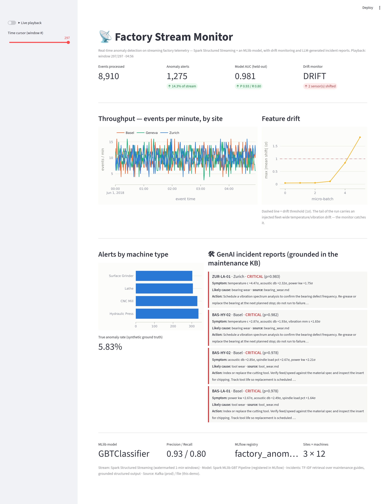

# Factory Stream Monitor

Real-time anomaly detection on **streaming** factory telemetry: a Kafka → **Spark Structured
Streaming** pipeline scores every reading with a **Spark MLlib** model, watches the live input for
**data drift**, and turns each alert into a **grounded, LLM-style incident report** — shown on an
auto-refreshing operations dashboard.

This is the streaming, real-time counterpart to the rest of this smart-factory portfolio: the sensor
telemetry of the batch analytics project, the maintenance knowledge base of the RAG project, and the
Swiss plant model — now joined into one live monitoring platform.



## What it does (four layers)

**1 · Stream (Spark Structured Streaming).** Telemetry events arrive on a Kafka topic (production) or a
file source (this self-contained demo/CI — same schema either way). A **watermarked, tumbling 1-minute
window** aggregation computes throughput and average sensor levels per site & machine type — the
"streaming SQL" core, running as a stateful streaming query.

**2 · Score (Spark MLlib).** A persisted **GBT classifier Pipeline** (categorical encoding → feature
assembly → scaling → gradient-boosted trees, tuned by **3-fold cross-validation**) scores each
micro-batch inside `foreachBatch` — the standard way to apply an ML model in a streaming query.
Held-out performance: **AUC 0.981, precision 0.93, recall 0.80, F1 0.86**. The model is versioned in the
**MLflow Model Registry**.

**3 · Watch for drift (MLOps).** A model is only as good as the assumption that live data looks like its
training data. Each micro-batch's feature distribution is compared to the training reference (a per-sensor
z-shift), and data-quality bounds catch out-of-spec readings. In the demo, the stream's tail carries an
injected **fleet-wide temperature/vibration drift** — the monitor flags it (drift climbs past the 1σ
threshold, and the model's alert rate visibly spikes from ~6% to ~14%, exactly the silent degradation
drift monitoring exists to catch).

**4 · Explain (GenAI).** Each alert becomes a **structured incident report** grounded in a maintenance
knowledge base: the abnormal sensors are read off (z-scores), matched to the most likely fault, and the
**recommended action is quoted from the retrieved maintenance guide** — never invented. It runs fully
offline and free (deterministic grounded output); with an LLM key it can narrate the same facts (the same
graceful 3-tier fallback as the rest of the portfolio). Cause and cited source always agree.

## Architecture

```
 telemetry producer ──► Kafka topic ──►  Spark Structured Streaming
   (Swiss factory                          │
    sensor events)              ┌──────────┴───────────┐
                                ▼                      ▼
                   watermarked 1-min windows    foreachBatch: MLlib scoring
                   (throughput, avg sensors)    + drift check + alerts
                                └──────────┬───────────┘
                                           ▼
                         alerts ─► GenAI incident reports (grounded in maintenance KB)
                                           ▼
                        auto-refreshing Streamlit + Plotly ops dashboard
```

Heavy work (model training, the streaming run) is offline; the dashboard reads the committed stream
outputs and replays them on a live time-cursor, so the deployed image carries no Spark — the same
heavy-batch → light-serving split as the rest of this portfolio. The full **docker-compose** stack
(Kafka + producer + Spark job + dashboard) is the production wiring; the in-repo demo validates the same
Spark job against a file source, so it's fully runnable without standing up a broker.

## Real numbers (measured in-sandbox)

| | |
|---|---|
| MLlib model | GBT Pipeline, 3-fold CV, **AUC 0.981 / P 0.93 / R 0.80 / F1 0.86** |
| Streaming run | 9,000 events → **264** watermarked 1-min windows across 3 sites, 12 machines |
| Drift | injected tail drift **caught** (max shift 1.85σ, 2 sensors flagged; alert rate 6%→14%) |
| Incidents | grounded structured reports, cause ↔ cited maintenance guide always consistent |

## Running it

```bash
pip install -r requirements-pipeline.txt   # pyspark, kafka-python, scikit-learn, mlflow, ...

python -m stream.train_model               # train + register the MLlib model (writes data/model)
python scripts/run_local_demo.py           # stream (file source) -> alerts -> drift -> incidents
streamlit run dashboard/app.py             # the ops dashboard (toggle "Live playback")
```

The full streaming stack (Kafka + Spark + dashboard):

```bash
docker compose -f docker/docker-compose.yml up --build
```

### Tests

```bash
pytest tests/ -q      # 13 tests
```

Cover the labeled generator, the event schema, drift detection (clean vs shifted batches), the grounded
incident reports (cause/source consistency, severity, signature→guide mapping), and **loading + scoring
the persisted MLlib pipeline** on a fresh sample.

### Live demo

Deployed on Render's free tier: **https://factory-stream-monitor.onrender.com**. A continuous stream
can't run on a free tier, so the deployed page replays the recorded stream outputs on a live cursor; the
full Kafka+Spark pipeline runs locally via docker-compose. Free tier spins down after 15 min idle (first
hit ~30–50 s).

## What I'd do next

- Serve the MiniLM embeddings behind the incident retriever via ONNX (the trick from this portfolio's
  surface-defect project) for semantic KB matching beyond TF-IDF.
- Add **stateful streaming anomaly detection** (per-machine EWMA / session windows) alongside the
  point classifier, to catch slow degradations the per-event model misses.
- Wire the drift alarm to auto-trigger a retraining job (close the MLOps loop), and add Spark MLlib
  model A/B comparison in the registry.
- Exactly-once sink to a warehouse table for the windowed metrics (Spark + Delta).
